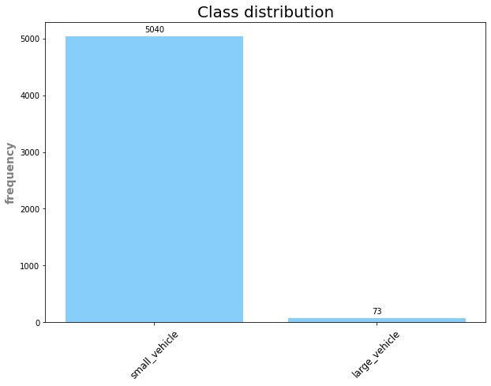
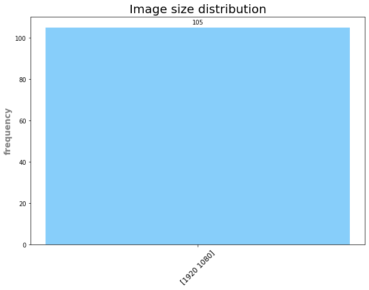
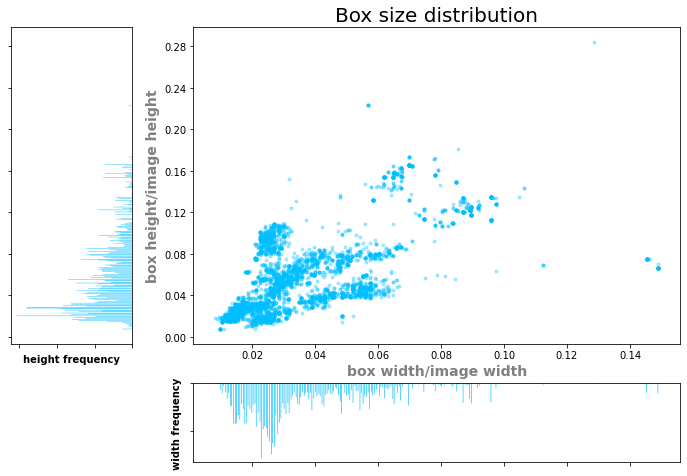
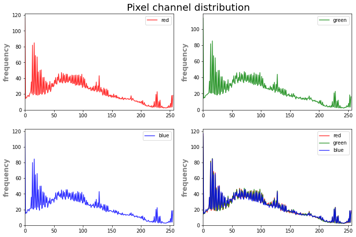

## Overview

Considering data labeling for Computer Vision (CV) tasks, various deep learning projects use different annotation formats while training. Thus, rises a necessity to convert dataset annotations from one format to another (e.g. from **COCO** to **Yolo** or vice versa). 
This project offers a flexible solution to this problem. In addition to adjustable format conversion, we develop a set of methods for working with annotations, such as **class renaming**, **image slicing** and **dataset splitting**. We also continue to develop new methods.

We have implemented a dataset primary analysis  (**EDA**). You will see examples of this functionality below:
- dataset class distribution
- dataset image size distribution
- analysis of box size distribution
- distribution of bounding box geometrical characteristics  (width, height - both absolute and relative values)
- channel-wise brightness distribution

All basic code functionality is covered by tests.

### Currently supported formats

The following formats were implemented:
- LabelMe
- MSCOCO
- PascalVOC
- VGG Image Annotator (VIA)
- Yolo
- Yolo Darknet
	
We continue developing support for new annotation formats.

## Table 

- [Overview](#overview)
	+ [Format Zoo](#currently-supported-formats)
- [Getting started](#getting-started)
 	+ [Prerequisites](#prerequisites)
 	+ [Quick start](#quick-start)
 	+ [Load data](#load-data)
	+ [Annotation tools](#annotation-tools)
 	+ [EDA](#eda)
- [Citation](#citation)


## Getting started

### Prerequisites

The project supports Python 3.8. We do not take any responsibility for any other version compatibility.

```bash
git clone https://github.com/rubetek/rubetools.git
pip -m venv venv
source venv/bin/activate
pip install -r requirements.txt
```
	
### Quick start

For quick start see [**tutorial**](quick-start-tutorial.ipynb).

Let's assume that we have PascalVOC annotation format as an input.

### Import

```python
import os
import warnings
warnings.filterwarnings('ignore')

import rubetools
from rubetools import PascalVOC, Yolo, MSCOCO
```

### Load data

```python
pascal_img_dir = os.path.join('data/images')
pascal_ann_dir = os.path.join('data/pascalvoc')
pascalvoc = PascalVOC(ann_path=pascal_ann_dir, img_path=pascal_img_dir)
```

### Annotation tools

Convert to Yolo and MSCOCO:
```python
pascalvoc.convert_to(Yolo, save_path='data/output/yolo', is_save_images=True)
pascalvoc.convert_to(MSCOCO, save_path='data/output/mscoco', is_save_images=True)
```

Let's rename classes and save this changes, for example, in current location:
```python
pascalvoc.rename_classes(rename_dict={'small_vehicle': 'car', 'large_vehicle': 'car'})
pascalvoc.save(save_dir='output/pascalvoc')
```
If you want to cut images into fragments and prepare corresponding annotations, do the following: 
```python
pascalvoc.slice_images(img_save_dir='data/output', shape=(416, 416))
pascalvoc.save(save_dir='output')
```
For dataset splitting by train and test call:
```python
pascal_train, pascal_test = pascalvoc.split(ratio=(0.8, 0.2))
```

### EDA

Let's get statistics on main annotation characteristics in Pandas format.
```python
pascalvoc.eda.info_df.head()
```

|№|filename|img_width|img_height|box_width|box_height|label|type|
|:---:|:----:|:----:|:----------:|:----------:|:----------:|:------:|:------:|
0|img1.jpg|1920|1080|49.0|105.0|small_vehicle|HBox
1|img2.jpg|1920|1080|52.0|117.0|small_vehicle|HBox
2|img3.jpg|1920|1080|43.0|102.0|small_vehicle|HBox
3|img4.jpg|1920|1080|44.0|104.0|small_vehicle|HBox
4|img5.jpg|1920|1080|44.0|100.0|small_vehicle|HBox
	

Class distribution:
```python
pascalvoc.eda.plot_classes_histogram()
```



Here we can observe class disproportion: class "small_vehicle" is much more frequent. It may be considered to rename all classes to one unified class or extend the dataset.
	
Image size distribution:
```python
pascalvoc.eda.plot_image_size_histogram()
```

	

This bar graph shows us that all the images have the same size 1920x1080.
	
Object size distribution in relative values:
```python
pascalvoc.eda.plot_objects_frequency_scatter()
```



The majority of bounding boxes are relatively small occupying approximately the same part of the image area.

Channel-wise brightness distribution:
```python
pascalvoc.eda.image_color_histogram()
```



This plot indicates the distribution of RGB pixels - we can see that the highest values are reached in [1;100].

## Citation

Please use this bibtex if you want to cite this repository in your publications:

	@misc{rubetools,
		author = {Rubetek},
		title = {rubetools},
		year = {2021},
		publisher = {GitHub},
		journal = {GitHub repository},
		howpublished = {\url{https://github.com/rubetek/rubetools.git}},
		}
